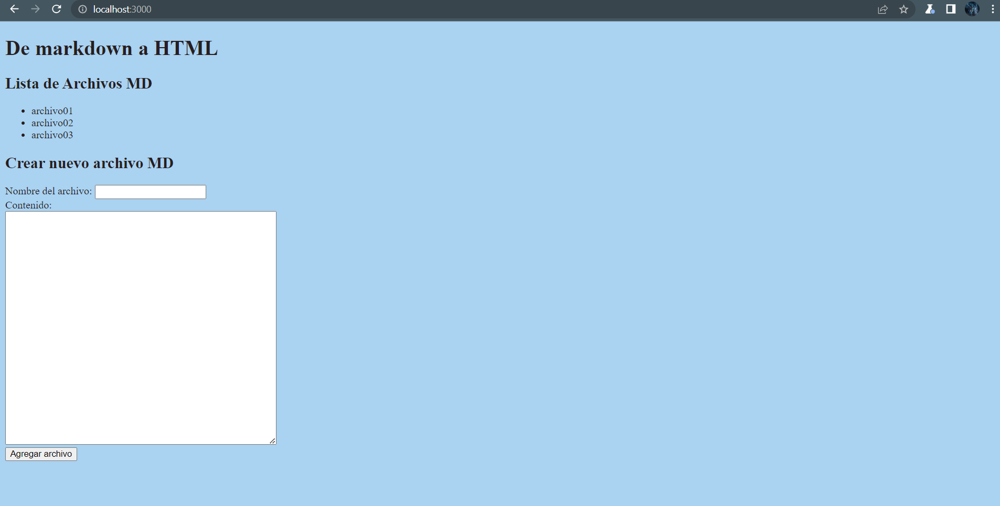
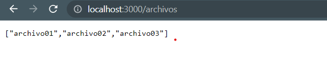
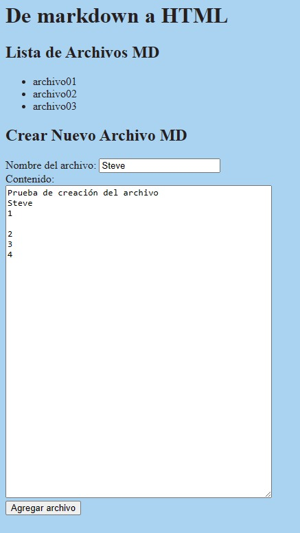
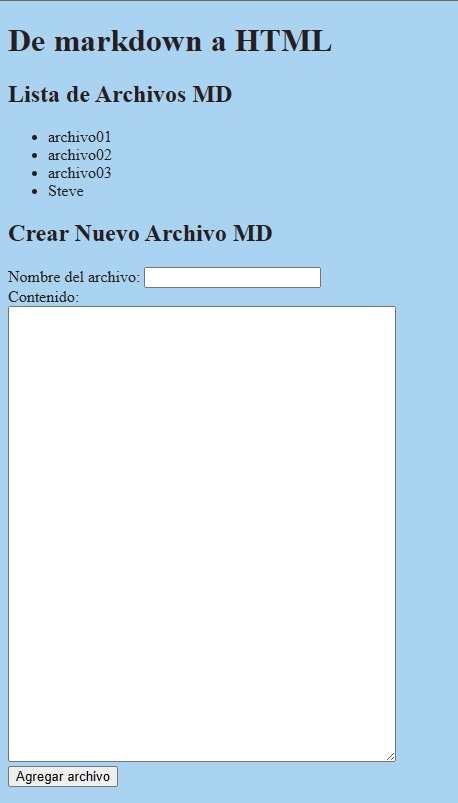
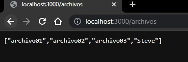

<table>
    <theader>
        <tr>
            <td></td>
            <th>
                UNIVERSIDAD NACIONAL DE SAN AGUSTIN 
                FACULTAD DE INGENIERÍA DE PRODUCCIÓN Y SERVICIOS 
                DEPARTAMENTO ACADÉMICO DE INGENIERÍA DE SISTEMAS E INFORMÁTICA 
                ESCUELA PROFESIONAL DE INGENIERÍA DE SISTEMAS
            </th>
            <td></td>
        </tr>
    </theader>
    <tbody>
        <tr><td colspan="3">Formato: Práctica de Laboratorio</td></tr>
        <tr><td>Aprobación:  2022/03/01</td><td>Código: GUIA-PRLD-001</td><td>Página: 1</td></tr>
    </tbody>
</table>

GUÍA DE LABORATORIO 

<table>
<theader>
<tr><th colspan="6">INFORMACIÓN BÁSICA</th></tr>
</theader>
<tbody>
<tr><td>ASIGNATURA:</td><td colspan="5">Programación Web 2</td></tr>
<tr><td>TÍTULO DE LA PRÁCTICA:</td><td colspan="5">Ayax y NodeJS</td></tr>
<tr>
<td>NÚMERO DE PRÁCTICA:</td><td>03</td><td>AÑO LECTIVO:</td><td>2022 A</td><td>NRO. SEMESTRE:</td><td>III</td>
</tr>
<tr>
<td>FECHA INICIO::</td><td>23-May-2023</td><td>FECHA FIN:</td><td>29-May-2023</td><td>DURACIÓN:</td><td>04 horas</td>
</tr>
<tr><td colspan="6">INTEGRANTES:
    <ul>
        <li>ALFONSO HUACASI ALEJANDRO SEBASTIAN</li>
        <li>CHANCUAÑA ALVIS KLISMANN</li>        
        <li>CONGONA MANRIQUE MAURICIO ELIAS</li>
        <li>FOROCCA MAMANI MAXS SEBASTIAN JOAQUIN</li>
    </ul>
</td>
</<tr>
<tr><td colspan="6">DOCENTE:
<ul>
<li>Anibal Sardon</li>
</ul>
</td>
</<tr>
</tdbody>
</table>

## EJERCICIOS PROPUESTOS
- Repositorios personales, para probar los ejercicios resueltos en el laboratorio.
    - Repositorio de Alejandro Alfonso: 
    - Repositorio de Klismann Chancuaña: https://github.com/klismannSis/Proyecto_NodeJS.git
    - Repositorio de Mauricio Congona: https://github.com/MauCausa/Pweb2.git
    - Repositorio de Maxs Forocca: https://github.com/MaxsForocca/LAB-PWEB2-Ind.git
- En grupos de 3 a 5 personas implemente una aplicación web que navegue sobre archivos Markdown y permita:
-
    - Listas de los archivos Markdown disponibles:
    -
    - Ver el contenido de un archivo Markdown traducido a HTML:
    - Crear nuevos archivos MarkDown y almacenarlos en el servidor:  
    Creamos el archivo "Steve" con un contenido y se guarda con el botón "Agregar archivo" 
      
    Vemos que se guardó en el listado de archivos del index.html  
      
    Y también se guardó en el listado de archivos  
      
    
- La comunicación entre el cliente y el servidor tiene que ser usando JSON sólamente. El cliente debe usar AJAX para sus peticiones El servidor debe usar NodeJS Su aplicación debe ser de página única, es decir que sólo habrá un archivo index.html y nada más.
- Si los enlaces proporcionado en esta guía no le son suficientes, puede revisar códigos en Internet que le ayuden con cosas como ejemplos: listar un directorio en NodeJS; pero deberá incluir los enlaces correspondientes en sus archivos como comentarios y sólo podrá usar código de stackoverflow, incluir código de cualquier otra fuente está prohibido y se considerará actitud deshonesta.

#

## CUESTIONARIO
- En el Ejemplo "Hola Mundo" con NodeJS. ¿Qué pasó con la línea: "Content type ….."?
    - El "Content-type" es la propiedad que se especifica en el header y sirve para indicar qué tipos de datos que se enviarán entre el cliente y el servidor. El "Content-type" en el lado del servidor indica el tipo de dato que le enviará al cliente, en este caso aplication/json o datos en formato JSON. Y en el lado del cliente, el tipo de dato que desea recibir (JSON).
- En los ejercicios. ¿En qué lugar debería estar el archivo poema.txt?
    - El archivo poema.txt debería ubicarse en el directorio privado 'priv'.
- ¿Entiende la expresión regular en el código y se da cuenta de para qué es útil?
    - Si, el método "replace" en el ejercicio del poema (text : data.replace(/\n/g, 'br');) buscará todas las coincidencias (/g) en las que aparezcan los saltos de línea (\n) y los reemplazará por saltos de línea HTML (br). Esto es útil para reemplazar la secuencia de caracteres que se repitan varias veces por otro. En el ejemplo sirvió para visualizar el poema en un formato HTML.
- Note que la respuesta del servidor está en formato JSON, ¿Habrá alguna forma de verla directamente?
    - El formato JSON se puede visualizar accediendo a la URL que proporcione el JSON, de acuerdo al navegador los datos JSON se visualizarán de diferente forma.

#

## REFERENCIAS
    https://developer.mozilla.org/es/docs/Web/HTTP/Headers/Content-Type
    https://es.stackoverflow.com/questions/520507/como-especificar-content-type-en-fetch
    https://developer.mozilla.org/es/docs/Web/JavaScript/Guide/Regular_expressions
    https://learn.microsoft.com/es-es/microsoft-edge/devtools-guide-chromium/json-viewer/json-viewer

#
